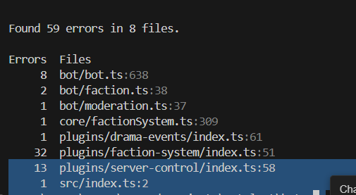
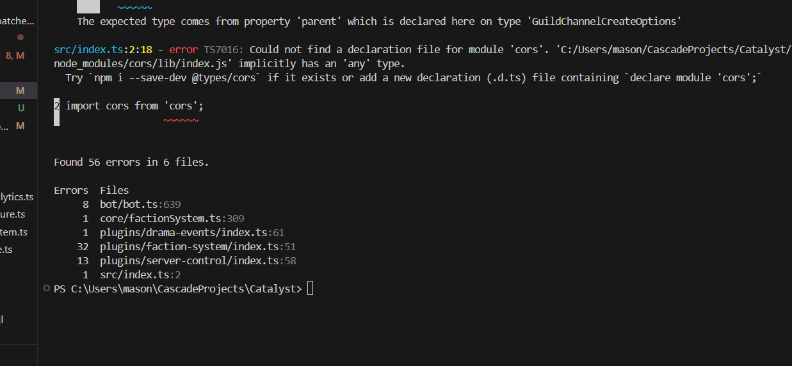
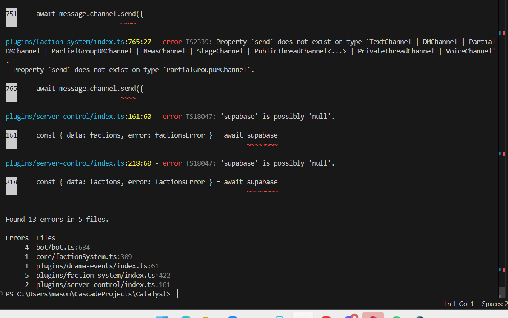
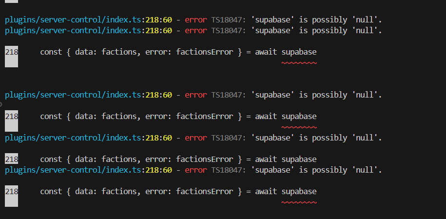

# Catalyst Discord Gamification Engine

**Catalyst** is a modular, fully interactive Discord bot engine for gamifying communities through playful, creative events (plot twists, showdowns, aura-offs, and spotlights), voting, and dynamic channels.

### Core Features | Goals
- Persistent world state: users, factions, and playful event history (plot twists, showdowns, spotlights) are saved and evolve in real time.
- Dynamic channel management (`hub`, `config`, `powers`, `mods`, `timeline`).
- Emoji voting and interactive buttons on all major events and proposals.
- Plugin proposals and voting.
- Spotlight timeline and playful analytics with leaderboard and event summaries.
- No slash commands needed—users interact via buttons, emoji, and dynamic messages.
- Positive, community-focused design: All mechanics encourage creativity, collaboration, and fun rather than competition or negativity.

## Status & Known Issues (as of 2025-04-28)
- **INTEGRATION COMPLETE:** World State Manager, Dynamic Event Generator, and Progression System are integrated and persist state to disk.
- **KNOWN ISSUES:**
    - Some TypeScript syntax errors remain (unmatched brackets, misplaced code blocks).
    - Lint errors: implicit `any` types, duplicate imports, and type guards needed for channel lookups.
    - Bot may not start until these errors are fixed. See `TODO.md` for details.

## Next Steps
- **Fix all remaining TypeScript errors and lint issues.**
- **Test the bot end-to-end:** drama, faction, and timeline features.
- **Expand dramatic events and analytics.**
- **Polish onboarding and user feedback.**

See [`TODO.md`](./TODO.md) for a detailed breakdown of immediate technical tasks and future enhancements.

## Setup & Usage
See [`docs/CATALYST_README.md`](docs/CATALYST_README.md) for the latest setup instructions, feature breakdown, and all major functions/utilities.

## Repository
[https://github.com/Zwin-ux/Catalyst](https://github.com/Zwin-ux/Catalyst)

---
For design docs, planning, and full feature details, see the `/docs` directory.
